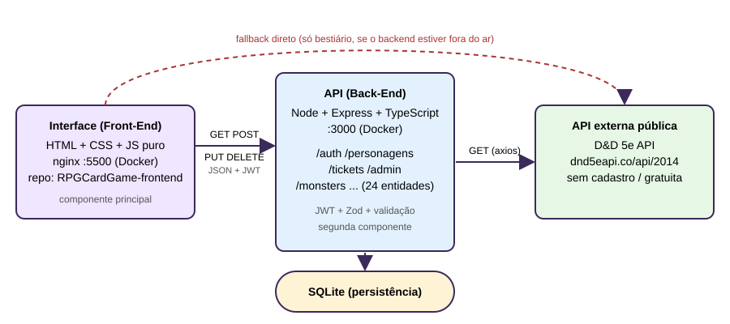

# Frontend — RPGCardGame ("AuroraRPG")

Interface web do **RPGCardGame**, um jogo de cartas de RPG inspirado em D&D 5e
(MVP da disciplina de componentização e serviços). O usuário cria conta,
gerencia seus personagens, consulta o bestiário de monstros da D&D 5e e abre
tickets de suporte. Em HTML/CSS/JS puro, **sem bundler nem framework**.

Este é o **componente principal (Interface)** do sistema. Ele conversa com a API
própria (componente secundário) e, por meio dela, com uma API externa pública.

| Módulo | Papel | Repositório |
| --- | --- | --- |
| Interface (este repo) | Componente principal | https://github.com/claudiaraphael/RPGCardGame-frontend |
| API (back-end) | Segunda componente: regras, login, SQLite | https://github.com/claudiaraphael/RPGCardGame |
| D&D 5e API | Serviço externo público | https://www.dnd5eapi.co/ |

## Arquitetura



- O navegador carrega a interface (nginx, porta `5500`).
- A interface chama a API própria em `http://localhost:3000` (JSON, JWT no
  header `Authorization: Bearer`).
- A API valida os dados com Zod, grava em **SQLite** (usuários, personagens,
  tickets) e consulta a **D&D 5e API** externa com `axios`.
- Só o bestiário tem um *fallback*: se o backend estiver fora do ar, ele
  consulta `https://www.dnd5eapi.co` direto.

## Chamadas HTTP da interface

A interface usa os quatro métodos exigidos:

| Método | Rota (backend) | Onde |
| --- | --- | --- |
| `GET` | `/personagens`, `/tickets/me`, `/monsters`, `/monsters/:index` | personagens, suporte, bestiário |
| `POST` | `/auth/register`, `/auth/login`, `/personagens`, `/tickets` | login, personagens, suporte |
| `PUT` | `/personagens/:id` | personagens (editar) |
| `DELETE` | `/personagens/:id` | personagens (excluir) |

## Páginas

| Página | O que faz |
| --- | --- |
| `index.html` | Landing |
| `components/login/login.html` | Entrar / criar conta |
| `components/personagens/personagens.html` | CRUD de personagens (exige login) |
| `components/equip/` | Menu de equipamentos do personagem |
| `components/suporte/suporte.html` | Central de Suporte: abrir e ver tickets (exige login) |
| `components/bestiario/monster-index.html` | Índice de monstros: busca, filtros, paginação, statblock |

Cada página tem sua pasta em `components/`; o que é comum a todas fica em
`components/shared/` (tokens, base, componentes, sessão, efeitos).

## API externa utilizada

**[D&D 5e API](https://www.dnd5eapi.co/)**

- **Gratuita e pública.** Não exige cadastro, chave de API nem autenticação.
- **Licença:** dados do SRD 5.1, sob Open Game Content
  ([detalhes legais](https://5e-bits.github.io/docs/legal)). O projeto é
  conteúdo de fã não oficial, sem afiliação com a Wizards of the Coast.
- **Rotas consumidas** (base `https://www.dnd5eapi.co/api/2014`), todas `GET`:
  - `/monsters` e `/monsters/:index` — usadas pelo bestiário (via backend, ou
    direto no fallback).
  - O backend expõe também as outras categorias: `spells`, `classes`, `races`,
    `equipment`, `skills`, `features`, `magic-items`, `conditions` e mais.
- Os dados são consumidos e tratados dentro da aplicação. Não há
  redirecionamento para outro site.

## Instalação e execução

**Pré-requisitos:** [Node.js](https://nodejs.org/) 20.6+ (para o backend),
VS Code com a extensão **Live Server** (ou Docker).

1. Subir o backend (ver o README do repositório da API):
   ```bash
   cd backend
   npm install
   cp .env.example .env   # preencha DND_BASE_URL e JWT_SECRET
   npm run dev            # http://localhost:3000
   ```
2. Servir o front (não há dependências para instalar):
   - **Live Server:** abrir `index.html` (`localhost:5500` ou
     `127.0.0.1:5500`).
   - **Docker:** ver abaixo.
3. Criar uma conta em `components/login/login.html` para liberar personagens e
   suporte.

> O CORS do backend só libera `localhost:5500` e `127.0.0.1:5500`. Qualquer
> outra porta será bloqueada.

## Docker

Há um `Dockerfile` na raiz (nginx:alpine). Não usa `docker-compose`.

```bash
docker build -t rpgcardgame-frontend .
docker run -d --name rpgcardgame-frontend -p 5500:80 rpgcardgame-frontend
```

Abra `http://localhost:5500` (o backend precisa estar rodando em `:3000`).
Guia completo em [`DOCKER.md`](DOCKER.md).

## Estrutura de pastas

```
frontend/
├── index.html               # landing (fica na raiz: documento padrão do nginx)
├── components/
│   ├── shared/              # tokens.css, base.css, components.css, session.js
│   ├── landing/ login/ personagens/ equip/ suporte/ bestiario/
├── documentacao/            # arquitetura.svg, DOCUMENTACAO.md, planos e mockups
├── Dockerfile / .dockerignore
└── CLAUDE.md / to-do.md
```

## Convenções e segurança

- URL base da API numa constante só (`API_BASE_URL`, em
  `components/shared/session.js`).
- Dado vindo da API ou do usuário vai pro DOM com `textContent`/`createElement`,
  nunca `innerHTML`.
- Sessão: JWT no header `Authorization: Bearer <token>`, guardado em
  `localStorage` via `components/shared/session.js`.
- Não commitar `.env`, tokens ou senhas.

## Mais informações

- [`documentacao/DOCUMENTACAO.md`](documentacao/DOCUMENTACAO.md) — histórico do
  redesign, efeitos visuais, convenções e pendências.
- [`to-do.md`](to-do.md) — checklist do front.
