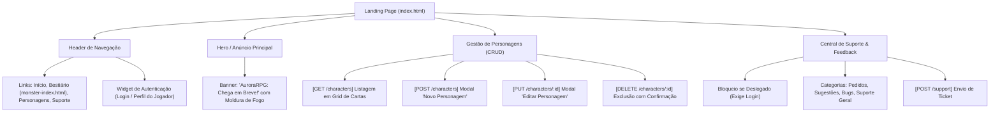

# Plano de Redesign: AuroraRPG Landing Page (`index.html`)

## 1. Paleta Oficial de Cores do Projeto (Atualizada)

Baseado no estudo de cor oficial e nas configurações de gradiente do Figma:

| Parada / Posição | Nome da Cor | Hex Code | Aplicação no Design |
| :--- | :--- | :--- | :--- |
| **Canvas / Foco** | **Electric Scion Blue** | `#0D19F4` | Canvas principal, anéis de foco, realce de links e ícones mágicos |
| **Profundidade** | **Midnight Cobalt** | `#060B68` / `#0E164D` | Fundo de cartões, superfície de painéis e modais translúcidos |
| **5% (Início)** | **Sunlight Gold (Yellow)** | `#FFD698` | Títulos dourados, molduras de cartas raras, valores de atributos |
| **29% (Médio)** | **Flame Coral (Orange)** | `#DF5F47` | Botões primários, badges de classe, auras solares, realces |
| **51% (Fim)** | **Deep Crimson (Red)** | `#BE1818` | Banners de aviso, bordas de dano/HP, cabeçalhos épicos |

---

## 2. Mockup Visual da Interface

Abaixo está o conceito visual desenhado para a Landing Page do AuroraRPG:


---

## 3. Arquitetura da Página & Estados de Usuário



---

## 4. Modelo de Dados para o CRUD de Personagens

Modelo compatível com o backend e pronto para validação posterior no Claude Code via Zod:

```typescript
export interface Character {
  id: string;               // UUID ou string gerada
  name: string;             // ex: "Eldrin Sombraluz"
  race: string;             // ex: "Elfo", "Humano", "Anão", "Draconato"
  class: string;            // ex: "Mago", "Guerreiro", "Ladino", "Paladino"
  level: number;            // ex: 1 a 20
  alignment: string;        // ex: "Caótico e Bom", "Neutro e Mau"
  hit_points: number;       // HP Máximo
  armor_class: number;      // AC
  attributes: {
    strength: number;
    dexterity: number;
    constitution: number;
    intelligence: number;
    wisdom: number;
    charisma: number;
  };
  image?: string;           // URL do avatar/arte do personagem
  notes?: string;           // Antecedente ou notas da campanha
  created_at: string;
}
```

---

## 5. Endpoints de Fetch Integrados no Frontend

| Operação | Método | Rota Backend | Descrição |
| :--- | :--- | :--- | :--- |
| **Listar** | `GET` | `http://localhost:3000/characters` | Carrega todos os personagens do usuário logado |
| **Criar** | `POST` | `http://localhost:3000/characters` | Cria novo personagem via formulário |
| **Atualizar**| `PUT` | `http://localhost:3000/characters/:id` | Atualiza HP, nível, atributos e notas |
| **Excluir** | `DELETE`| `http://localhost:3000/characters/:id` | Remove personagem do banco |
| **Suporte** | `POST` | `http://localhost:3000/support` | Envia ticket (Pedidos, Sugestões, Bugs, Dúvidas) |

*Nota: Todas as requisições contam com fallback resiliente para estado local (`localStorage`) caso o backend esteja em manutenção, permitindo teste instantâneo.*

---

## 6. Módulo de Suporte (Autenticação Obrigatória)

- **Categorias Suportadas**:
  - `pedidos`: Solicitações especiais ou requisições de mestres.
  - `sugestoes`: Propostas de novas mecânicas, regras e melhorias visuais.
  - `bugs`: Relato de erros técnicos ou comportamentos anômalos.
  - `suporte`: Dúvidas sobre regras, ficha ou conta de usuário.
- **Campos do Formulário**:
  - Categoria (Pills selecionáveis)
  - Título / Assunto
  - Nível de Prioridade (Baixa, Média, Alta, Crítica)
  - Descrição Detalhada
  - Botão com visual em degradê de fogo para submissão.
